# Design Document: Rural Career Mentor Platform

## Overview

The Rural Career Mentor Platform is an AWS-powered, voice-first mobile application that provides AI-driven career guidance to rural youth in India. Built specifically for the AWS AI for Bharat hackathon, this solution demonstrates how AWS AI services can democratize career mentorship and bridge the digital divide for millions of underserved youth.

The platform leverages AWS's comprehensive AI/ML stack and serverless architecture to deliver personalized career recommendations, skill development guidance, resume generation, interview preparation, and job matching services at scale.

### Hackathon Impact Statement

**Problem**: 65% of India's population lives in rural areas, yet less than 5% have access to professional career counseling. This creates a massive opportunity gap affecting 200+ million youth.

**Solution**: An AI-powered, voice-first platform that makes career guidance accessible in regional languages, works on affordable devices, and operates in low-bandwidth environments.

**AWS Innovation**: Demonstrates AWS AI services (Transcribe, Polly, Bedrock, Personalize) working together to solve a critical social challenge with measurable impact.

**Scalability**: Architecture designed to serve 10 million users within 12 months, with potential to expand across India and similar markets.

### Design Principles

- **AWS-Native Architecture**: Built entirely on AWS services for maximum scalability and reliability
- **Voice-First Design**: All interactions optimized for voice using Amazon Transcribe and Polly
- **AI-Powered Personalization**: Amazon Bedrock and Personalize for intelligent recommendations
- **Serverless-First**: Lambda and API Gateway for cost-effective scaling from zero to millions
- **Multilingual Core**: Regional language support using AWS AI services with Indic language models
- **Offline-First**: Critical functionality works offline with DynamoDB sync
- **Privacy by Design**: Data encrypted and localized to India using AWS Mumbai region

## Architecture

### High-Level AWS Architecture

```mermaid
graph TB
    subgraph "Client Layer"
        MobileApp[Mobile App - Android/PWA]
        VoiceUI[Voice Interface]
        LocalCache[Local Cache - DynamoDB Local]
    end
    
    subgraph "AWS Edge Services"
        CloudFront[CloudFront CDN]
        Route53[Route 53 DNS]
    end
    
    subgraph "AWS API Layer - Mumbai Region"
        APIGateway[API Gateway REST/WebSocket]
        Cognito[Amazon Cognito]
        WAF[AWS WAF]
    end
    
    subgraph "AWS Compute Layer - Serverless"
        VoiceLambda[Voice Processing Lambda]
        ProfileLambda[Profile Service Lambda]
        CareerLambda[Career Service Lambda]
        SkillLambda[Skill Service Lambda]
        ResumeLambda[Resume Service Lambda]
        InterviewLambda[Interview Service Lambda]
        JobLambda[Job Matching Lambda]
    end
    
    subgraph "AWS AI/ML Services"
        Transcribe[Amazon Transcribe - Indic Languages]
        Polly[Amazon Polly - Neural Voices]
        Bedrock[Amazon Bedrock - Claude/Llama]
        Personalize[Amazon Personalize]
        Comprehend[Amazon Comprehend]
        Rekognition[Amazon Rekognition - Document Analysis]
    end
    
    subgraph "AWS Data Layer"
        DynamoDB[(DynamoDB - User Profiles)]
        RDS[(RDS Aurora Serverless - Career Data)]
        OpenSearch[(OpenSearch - Job Search)]
        S3[(S3 - Resumes & Audio)]
        ElastiCache[(ElastiCache - Session Cache)]
    end
    
    subgraph "AWS Integration Services"
        EventBridge[EventBridge]
        SQS[SQS Queues]
        SNS[SNS Notifications]
        StepFunctions[Step Functions - Workflows]
    end
    
    subgraph "AWS Monitoring & Security"
        CloudWatch[CloudWatch Logs & Metrics]
        XRay[X-Ray Tracing]
        KMS[KMS Encryption]
        SecretsManager[Secrets Manager]
    end
    
    MobileApp --> CloudFront
    CloudFront --> APIGateway
    APIGateway --> WAF
    APIGateway --> Cognito
    
    APIGateway --> VoiceLambda
    APIGateway --> ProfileLambda
    APIGateway --> CareerLambda
    APIGateway --> SkillLambda
    APIGateway --> ResumeLambda
    APIGateway --> InterviewLambda
    APIGateway --> JobLambda
    
    VoiceLambda --> Transcribe
    VoiceLambda --> Polly
    VoiceLambda --> Bedrock
    
    CareerLambda --> Bedrock
    CareerLambda --> Personalize
    CareerLambda --> RDS
    
    InterviewLambda --> Transcribe
    InterviewLambda --> Bedrock
    InterviewLambda --> Comprehend
    
    ResumeLambda --> Bedrock
    ResumeLambda --> S3
    
    ProfileLambda --> DynamoDB
    JobLambda --> OpenSearch
    
    VoiceLambda --> EventBridge
    EventBridge --> SQS
    
    CloudWatch --> XRay
```



### AWS Service Justification

#### Why AWS for This Hackathon Solution

1. **Amazon Transcribe**: Best-in-class Indic language support (Hindi, Tamil, Telugu, Bengali, Marathi) with custom vocabulary for career terms
2. **Amazon Polly**: Neural TTS voices for natural-sounding regional language output
3. **Amazon Bedrock**: Access to Claude 3 for intelligent career counseling and personalized guidance
4. **Amazon Personalize**: ML-powered career recommendations based on user profiles and outcomes
5. **AWS Lambda**: Serverless compute scales automatically from 0 to millions of requests
6. **DynamoDB**: Single-digit millisecond latency for user profiles, global tables for multi-region
7. **API Gateway**: Built-in throttling, caching, and WebSocket support for real-time voice
8. **CloudFront**: Edge caching reduces latency for rural users across India

### Component Descriptions

#### Client Layer
- **Mobile App**: React Native (Android) + PWA, optimized for 2GB RAM devices
- **Voice Interface**: WebRTC for real-time audio streaming to AWS
- **Local Cache**: DynamoDB Local for offline-first capabilities

#### AWS Edge Services
- **CloudFront**: Global CDN with India edge locations, caches static assets and API responses
- **Route 53**: DNS with latency-based routing to nearest AWS region

#### AWS API Layer
- **API Gateway**: REST APIs for CRUD operations, WebSocket for real-time voice streaming
- **Amazon Cognito**: User authentication with phone number (OTP via SNS)
- **AWS WAF**: Protection against DDoS, SQL injection, XSS attacks

#### AWS Compute Layer (Serverless)
All services implemented as Lambda functions with:
- **Runtime**: Node.js 20.x for JavaScript, Python 3.12 for ML workloads
- **Memory**: 512MB-3GB based on workload
- **Concurrency**: Reserved concurrency for critical functions
- **Cold Start Optimization**: Provisioned concurrency for voice processing

#### AWS AI/ML Services
- **Amazon Transcribe**: Real-time streaming transcription, custom vocabulary for career terms
- **Amazon Polly**: Neural voices (Aditi for Hindi, etc.), SSML for natural prosody
- **Amazon Bedrock**: Claude 3 Sonnet for career counseling, resume writing, interview feedback
- **Amazon Personalize**: Collaborative filtering for career recommendations
- **Amazon Comprehend**: Sentiment analysis for interview responses
- **Amazon Rekognition**: Document text extraction for educational certificates

#### AWS Data Layer
- **DynamoDB**: User profiles, session data, offline sync queue (single-digit ms latency)
- **RDS Aurora Serverless**: Career paths, skills, courses (auto-scaling, pay-per-use)
- **OpenSearch**: Job listings with geospatial search (within 50km radius)
- **S3**: Resume PDFs, audio recordings, with lifecycle policies for cost optimization
- **ElastiCache**: Redis for API response caching, session management

#### AWS Integration Services
- **EventBridge**: Event-driven architecture for async workflows
- **SQS**: Queue for offline sync, resume generation, batch jobs
- **SNS**: SMS notifications for OTP, job alerts
- **Step Functions**: Orchestrate multi-step workflows (resume generation, interview sessions)

#### AWS Monitoring & Security
- **CloudWatch**: Centralized logging, custom metrics, alarms
- **X-Ray**: Distributed tracing for performance optimization
- **KMS**: Encryption keys for data at rest
- **Secrets Manager**: API keys, database credentials rotation

## Technology Stack (AWS-Optimized)

### Frontend
- **Framework**: React Native for Android + React PWA
- **State Management**: Redux Toolkit with RTK Query
- **Voice Streaming**: WebRTC for real-time audio to API Gateway WebSocket
- **Offline Storage**: DynamoDB Local (mobile), IndexedDB (PWA)
- **AWS SDK**: AWS Amplify for simplified AWS service integration

### Backend (Serverless)
- **Compute**: AWS Lambda (Node.js 20.x, Python 3.12)
- **API**: Amazon API Gateway (REST + WebSocket)
- **Authentication**: Amazon Cognito with SMS OTP via SNS
- **Orchestration**: AWS Step Functions for complex workflows

### AI/ML Services (AWS Native)
- **Speech-to-Text**: Amazon Transcribe with Indic language support
- **Text-to-Speech**: Amazon Polly with Neural voices
- **LLM**: Amazon Bedrock (Claude 3 Sonnet for career counseling)
- **Recommendations**: Amazon Personalize for career matching
- **NLU**: Amazon Comprehend for sentiment and entity extraction
- **Document Processing**: Amazon Textract for certificate verification

### Data Storage (AWS Managed)
- **User Profiles**: Amazon DynamoDB (NoSQL, single-digit ms latency)
- **Career Data**: Amazon RDS Aurora Serverless v2 (PostgreSQL)
- **Job Search**: Amazon OpenSearch Service with geospatial queries
- **File Storage**: Amazon S3 with Intelligent-Tiering
- **Cache**: Amazon ElastiCache (Redis) for session and API caching

### Integration & Messaging
- **Event Bus**: Amazon EventBridge for event-driven architecture
- **Queues**: Amazon SQS for async processing
- **Notifications**: Amazon SNS for SMS and push notifications
- **Workflows**: AWS Step Functions for multi-step processes

### Security & Compliance
- **Encryption**: AWS KMS for data encryption at rest
- **Secrets**: AWS Secrets Manager for credential rotation
- **WAF**: AWS WAF for API protection
- **Compliance**: AWS Config for compliance monitoring

### Monitoring & Operations
- **Logging**: Amazon CloudWatch Logs with log insights
- **Metrics**: CloudWatch Metrics with custom dashboards
- **Tracing**: AWS X-Ray for distributed tracing
- **Alarms**: CloudWatch Alarms with SNS notifications

### Infrastructure as Code
- **IaC**: AWS CDK (TypeScript) for infrastructure provisioning
- **CI/CD**: AWS CodePipeline + CodeBuild + CodeDeploy
- **Version Control**: AWS CodeCommit or GitHub integration

## Data Models

### User Profile
```typescript
interface UserProfile {
  userId: string;
  phoneNumber: string;
  educationLevel: '10th' | '12th';
  location: {
    district: string;
    state: string;
    coordinates: { lat: number; lng: number };
  };
  languagePreference: 'hi' | 'ta' | 'te' | 'bn' | 'mr';
  interests: string[];
  skills: string[];
  careerPreferences: string[];
  createdAt: Date;
  updatedAt: Date;
}
```

### Career Path
```typescript
interface CareerPath {
  careerId: string;
  title: { [lang: string]: string };
  description: { [lang: string]: string };
  requiredEducation: string[];
  requiredSkills: string[];
  salaryRange: { min: number; max: number; currency: string };
  demandScore: number;
  localDemand: { [state: string]: number };
  growthPotential: 'low' | 'medium' | 'high';
  relatedCareers: string[];
}
```

### Resume
```typescript
interface Resume {
  resumeId: string;
  userId: string;
  personalInfo: {
    name: string;
    phone: string;
    email?: string;
    location: string;
  };
  education: Array<{
    degree: string;
    institution: string;
    year: number;
    percentage?: number;
  }>;
  skills: string[];
  experience: Array<{
    title: string;
    organization: string;
    duration: string;
    description: string;
  }>;
  languages: { [lang: string]: string }; // language: proficiency level
  generatedAt: Date;
  versions: {
    english: string; // S3 URL
    regional: string; // S3 URL
  };
}
```

### Job Listing
```typescript
interface JobListing {
  jobId: string;
  title: string;
  company: string;
  location: {
    address: string;
    coordinates: { lat: number; lng: number };
  };
  description: string;
  requirements: {
    education: string[];
    skills: string[];
    experience?: string;
  };
  salaryRange?: { min: number; max: number };
  jobType: 'full-time' | 'part-time' | 'apprenticeship' | 'gig';
  source: string;
  postedAt: Date;
  expiresAt: Date;
}
```

### Mock Interview Session
```typescript
interface InterviewSession {
  sessionId: string;
  userId: string;
  careerPath: string;
  language: string;
  questions: Array<{
    questionId: string;
    text: string;
    audioUrl: string;
  }>;
  responses: Array<{
    questionId: string;
    audioUrl: string;
    transcription: string;
    analysis: {
      pronunciationScore: number;
      fluencyScore: number;
      contentScore: number;
      feedback: string;
    };
  }>;
  overallScore: number;
  completedAt: Date;
}
```

## API Design

### Voice Interaction Endpoints

```
POST /api/v1/voice/transcribe
Request: { audioData: base64, language: string }
Response: { text: string, confidence: number }

POST /api/v1/voice/synthesize
Request: { text: string, language: string }
Response: { audioData: base64, duration: number }

POST /api/v1/voice/process
Request: { audioData: base64, language: string, context: object }
Response: { intent: string, entities: object, response: string, audioResponse: base64 }
```

### User Profile Endpoints

```
POST /api/v1/users/register
Request: { phoneNumber: string, otp: string }
Response: { userId: string, token: string }

GET /api/v1/users/profile
Response: UserProfile

PUT /api/v1/users/profile
Request: Partial<UserProfile>
Response: UserProfile

POST /api/v1/users/language
Request: { language: string }
Response: { success: boolean }
```

### Career Recommendation Endpoints

```
GET /api/v1/careers/recommendations
Response: { careers: CareerPath[], suitabilityScores: number[] }

GET /api/v1/careers/:careerId
Response: CareerPath

GET /api/v1/careers/:careerId/skills
Response: { skills: Skill[], learningResources: Resource[] }
```

### Resume Endpoints

```
POST /api/v1/resumes/create
Request: { personalInfo: object, education: array, skills: array, experience: array }
Response: Resume

GET /api/v1/resumes/:resumeId
Response: Resume

PUT /api/v1/resumes/:resumeId
Request: Partial<Resume>
Response: Resume

GET /api/v1/resumes/:resumeId/download
Query: { language: string, format: 'pdf' }
Response: PDF file
```

### Interview Coaching Endpoints

```
POST /api/v1/interviews/start
Request: { careerPath: string, language: string }
Response: { sessionId: string, firstQuestion: object }

POST /api/v1/interviews/:sessionId/respond
Request: { questionId: string, audioData: base64 }
Response: { analysis: object, nextQuestion: object }

GET /api/v1/interviews/:sessionId/feedback
Response: { overallScore: number, detailedFeedback: array }
```

### Job Matching Endpoints

```
GET /api/v1/jobs/search
Query: { location: string, radius: number, education: string, skills: string[] }
Response: { jobs: JobListing[], total: number }

GET /api/v1/jobs/:jobId
Response: JobListing

GET /api/v1/jobs/government-schemes
Query: { state: string }
Response: { schemes: array }
```

## Voice Interaction Flow (AWS-Powered)

### Real-Time Voice Streaming Architecture

```
User Speech → Mobile App → WebRTC Stream
    ↓
API Gateway WebSocket (wss://api.example.com/voice)
    ↓
Voice Processing Lambda (streaming)
    ↓
Amazon Transcribe (real-time streaming)
    ↓
Partial Transcripts → Lambda → Client (live feedback)
    ↓
Complete Transcript → Amazon Bedrock (Claude 3)
    ↓
AI Response Generation
    ↓
Amazon Polly (Neural TTS)
    ↓
Audio Stream → Lambda → WebSocket → Client
```

### Conversation Management with Amazon Bedrock

The platform uses Amazon Bedrock with Claude 3 Sonnet for context-aware conversations:

```python
# Bedrock conversation prompt template
system_prompt = """You are a career counselor for rural Indian youth. 
Speak in {language}. Be encouraging, practical, and culturally sensitive.
Focus on local opportunities and realistic career paths."""

conversation_context = {
    "user_profile": {
        "education": "12th",
        "location": "Patna, Bihar",
        "interests": ["computers", "technology"]
    },
    "conversation_history": [...],
    "current_intent": "career_recommendation"
}

# Bedrock API call
response = bedrock_runtime.invoke_model(
    modelId="anthropic.claude-3-sonnet-20240229-v1:0",
    body=json.dumps({
        "anthropic_version": "bedrock-2023-05-31",
        "max_tokens": 500,
        "system": system_prompt,
        "messages": conversation_context
    })
)
```

### Sample Conversation Flow (Career Recommendation)

```
User: "मुझे करियर के बारे में सलाह चाहिए" (I need career advice)
    ↓ Amazon Transcribe (Hindi)
System: [Bedrock Intent: career_inquiry]
    ↓ Amazon Bedrock generates response
    ↓ Amazon Polly (Aditi voice - Hindi Neural)
System: "बिल्कुल! मैं आपकी मदद करूंगा। आपने कौन सी कक्षा पास की है?" 
        (Sure! I'll help you. Which grade have you completed?)

User: "मैंने 12वीं पास की है" (I've completed 12th)
    ↓ Transcribe + Bedrock entity extraction
System: [Entity: education=12th] [Update DynamoDB profile]
    ↓ Bedrock generates contextual follow-up
System: "बहुत अच्छा! आपको किस क्षेत्र में रुचि है?" 
        (Great! What field are you interested in?)

User: "मुझे कंप्यूटर पसंद है" (I like computers)
    ↓ Transcribe + Bedrock + Comprehend sentiment
System: [Entity: interest=computers] [Sentiment: positive]
    ↓ Invoke Amazon Personalize for recommendations
    ↓ Bedrock formats recommendations in Hindi
System: "आपकी प्रोफाइल के आधार पर, मैं तीन करियर सुझा रहा हूँ:
        1. सॉफ्टवेयर डेवलपर - ₹3-6 लाख प्रति वर्ष
        2. डेटा एंट्री ऑपरेटर - ₹2-3 लाख प्रति वर्ष  
        3. कंप्यूटर हार्डवेयर टेक्नीशियन - ₹2.5-4 लाख प्रति वर्ष"
```

## Low-Bandwidth Optimization Strategy (AWS-Optimized)

### CloudFront Edge Caching

```javascript
// CloudFront cache behaviors for rural India
const cacheBehaviors = {
  staticAssets: {
    ttl: 86400, // 24 hours
    compress: true,
    viewerProtocolPolicy: 'redirect-to-https'
  },
  apiResponses: {
    ttl: 300, // 5 minutes for career data
    compress: true,
    forwardHeaders: ['Accept-Language', 'Authorization']
  },
  audioFiles: {
    ttl: 3600, // 1 hour
    compress: false, // Already compressed
    streamingDistribution: true
  }
};
```

### Adaptive Quality with Lambda@Edge

```javascript
// Lambda@Edge function for bandwidth detection
exports.handler = async (event) => {
  const request = event.Records[0].cf.request;
  const headers = request.headers;
  
  // Detect bandwidth from client hint or previous metrics
  const bandwidth = headers['downlink'] || 'unknown';
  
  const qualityTiers = {
    high: { // > 1 Mbps
      audioCodec: 'opus',
      audioBitrate: 64,
      pollyEngine: 'neural',
      transcribeModel: 'enhanced'
    },
    medium: { // 200 kbps - 1 Mbps
      audioCodec: 'opus',
      audioBitrate: 32,
      pollyEngine: 'neural',
      transcribeModel: 'standard'
    },
    low: { // < 200 kbps
      audioCodec: 'opus',
      audioBitrate: 16,
      pollyEngine: 'standard',
      transcribeModel: 'standard',
      enableTextFallback: true
    }
  };
  
  // Add quality tier to request headers
  request.headers['x-quality-tier'] = bandwidth > 1000 ? 'high' : 
                                       bandwidth > 200 ? 'medium' : 'low';
  return request;
};
```

### Offline Capabilities with DynamoDB Sync

```javascript
// AWS AppSync or custom sync with DynamoDB Streams
const offlineSync = {
  // Local DynamoDB for offline storage
  localDB: new DynamoDBLocal(),
  
  // Sync queue in SQS
  syncQueue: 'offline-sync-queue',
  
  // Conflict resolution strategy
  conflictResolution: 'last-write-wins',
  
  // Cached content types
  cachedContent: [
    'user_profile',
    'career_descriptions',
    'skill_information',
    'government_schemes',
    'resume_drafts'
  ],
  
  // Progressive sync priority
  syncPriority: [
    'user_profile_updates',
    'resume_changes',
    'job_applications',
    'interview_recordings',
    'analytics_events'
  ]
};
```

### S3 Transfer Acceleration for Rural Areas

- Enable S3 Transfer Acceleration for resume uploads
- Use CloudFront signed URLs for secure, fast downloads
- Implement multipart upload for large audio files
- Compress audio using Opus codec before upload

## Multilingual Support Architecture (Amazon Transcribe & Polly)

### Language Processing Pipeline

```
User Speech (Regional Language)
    ↓
Amazon Transcribe (Streaming or Batch)
  - Model: Indic language models (hi-IN, ta-IN, te-IN, bn-IN, mr-IN)
  - Custom Vocabulary: Career terms, job titles, skills
  - Accuracy: 85%+ with custom vocabulary
    ↓
Text in Regional Language
    ↓
Amazon Bedrock (Claude 3) - Intent Understanding
  - Prompt: Multilingual career counseling context
  - Entity Extraction: Education, location, interests, skills
    ↓
Business Logic Processing (Lambda)
  - Amazon Personalize: Career recommendations
  - DynamoDB: Profile updates
  - OpenSearch: Job matching
    ↓
Response Generation (Amazon Bedrock)
  - Context-aware responses in regional language
  - Culturally appropriate guidance
    ↓
Amazon Polly (Neural TTS)
  - Neural voices: Aditi (Hindi), Kajal (Hindi), etc.
  - SSML for natural prosody and emphasis
    ↓
Audio Response to User (via CloudFront)
```

### Supported Languages with AWS Services

| Language | ISO Code | Transcribe | Polly Neural | Bedrock Support |
|----------|----------|------------|--------------|-----------------|
| Hindi | hi-IN | ✓ | ✓ (Aditi, Kajal) | ✓ |
| Tamil | ta-IN | ✓ | ✓ (Planned) | ✓ |
| Telugu | te-IN | ✓ | ✓ (Planned) | ✓ |
| Bengali | bn-IN | ✓ | ✓ (Planned) | ✓ |
| Marathi | mr-IN | ✓ | ✓ (Planned) | ✓ |

### Custom Vocabulary for Amazon Transcribe

```json
{
  "Phrases": [
    {"Phrase": "सॉफ्टवेयर डेवलपर", "IPA": "sɔfʈveər ɖeveləpər", "DisplayAs": "Software Developer"},
    {"Phrase": "डेटा एंट्री", "IPA": "ɖeʈa enʈri", "DisplayAs": "Data Entry"},
    {"Phrase": "प्रधानमंत्री कौशल विकास योजना", "DisplayAs": "PMKVY"},
    {"Phrase": "रिज्यूमे", "IPA": "rizjume", "DisplayAs": "Resume"},
    {"Phrase": "इंटरव्यू", "IPA": "inʈərvju", "DisplayAs": "Interview"}
  ]
}
```

### Amazon Polly SSML for Natural Speech

```xml
<speak>
    <prosody rate="medium" pitch="medium">
        आपकी प्रोफाइल के आधार पर,
        <break time="500ms"/>
        मैं <emphasis level="strong">तीन करियर</emphasis> सुझा रहा हूँ।
        <break time="300ms"/>
        पहला है <prosody rate="slow">सॉफ्टवेयर डेवलपर</prosody>,
        जिसमें आप <say-as interpret-as="currency">₹300000</say-as> से 
        <say-as interpret-as="currency">₹600000</say-as> प्रति वर्ष कमा सकते हैं।
    </prosody>
</speak>
```

### Content Localization Strategy

- **Career Descriptions**: Stored in DynamoDB with language-specific attributes
- **UI Elements**: i18n with AWS Amplify localization
- **Dynamic Content**: Real-time translation via Amazon Bedrock
- **Fallback**: English fallback if regional translation unavailable

## Security Architecture (AWS Security Services)

### Authentication Flow with Amazon Cognito

```
1. User enters phone number in mobile app
2. App calls Cognito InitiateAuth API
3. Cognito triggers Lambda (Pre-Authentication)
4. Lambda sends OTP via Amazon SNS
5. User enters OTP in app
6. App calls Cognito ConfirmSignIn with OTP
7. Cognito validates OTP
8. Cognito returns JWT tokens (ID token, Access token, Refresh token)
9. App stores tokens in secure storage (Keychain/Keystore)
10. App includes ID token in Authorization header for API requests
11. API Gateway validates token using Cognito authorizer
```

### Data Encryption with AWS KMS

- **In Transit**: TLS 1.3 for all API communications (enforced by API Gateway)
- **At Rest**: 
  - DynamoDB: Encryption at rest with AWS managed KMS keys
  - RDS Aurora: Encryption with customer managed KMS keys
  - S3: Server-side encryption (SSE-KMS) for resumes and audio files
  - ElastiCache: Encryption at rest and in-transit
- **Audio Files**: Client-side encryption before upload, KMS envelope encryption
- **Sensitive Fields**: Application-level encryption for PII using AWS Encryption SDK

### Privacy Measures (AWS Config & Compliance)

- **Data Minimization**: Collect only essential information
- **Anonymization**: Use Amazon Kinesis Data Analytics for anonymized analytics
- **Data Residency**: All data in AWS Mumbai region (ap-south-1)
- **Access Control**: IAM roles with least privilege, Cognito user pools
- **Audit Logging**: CloudTrail for all AWS API calls, CloudWatch Logs for application logs
- **Compliance**: AWS Config rules for GDPR/Indian data protection compliance

### AWS WAF Rules for API Protection

```javascript
const wafRules = [
  {
    name: 'RateLimitRule',
    priority: 1,
    action: 'BLOCK',
    rateLimit: 100, // requests per 5 minutes per IP
  },
  {
    name: 'GeoBlockingRule',
    priority: 2,
    action: 'BLOCK',
    excludedCountries: ['IN'], // Only allow India
  },
  {
    name: 'SQLInjectionRule',
    priority: 3,
    action: 'BLOCK',
    managedRuleGroup: 'AWSManagedRulesSQLiRuleSet',
  },
  {
    name: 'XSSRule',
    priority: 4,
    action: 'BLOCK',
    managedRuleGroup: 'AWSManagedRulesKnownBadInputsRuleSet',
  }
];
```

## Scalability Design (AWS Auto-Scaling)

### Serverless Scaling with AWS Lambda

```javascript
// Lambda configuration for auto-scaling
const lambdaConfig = {
  voiceProcessing: {
    memory: 3008, // MB (for Transcribe streaming)
    timeout: 300, // 5 minutes for long conversations
    reservedConcurrency: 100, // Reserve for critical path
    provisionedConcurrency: 10, // Warm instances to avoid cold starts
  },
  careerRecommendation: {
    memory: 1024,
    timeout: 30,
    reservedConcurrency: 50,
  },
  resumeGeneration: {
    memory: 2048,
    timeout: 60,
    asyncInvocation: true, // Use SQS for async processing
  }
};
```

### DynamoDB Auto-Scaling

```javascript
// DynamoDB on-demand pricing for unpredictable traffic
const dynamoDBConfig = {
  userProfiles: {
    billingMode: 'PAY_PER_REQUEST', // Auto-scales to millions of requests
    pointInTimeRecovery: true,
    globalTables: ['ap-south-1', 'ap-south-2'], // Multi-region replication
  },
  sessionData: {
    billingMode: 'PAY_PER_REQUEST',
    ttl: true, // Auto-delete expired sessions
    streamEnabled: true, // For real-time sync
  }
};
```

### API Gateway Throttling & Caching

```javascript
const apiGatewayConfig = {
  throttling: {
    rateLimit: 10000, // requests per second
    burstLimit: 5000, // concurrent requests
  },
  caching: {
    enabled: true,
    ttl: 300, // 5 minutes
    cacheKeyParameters: ['userId', 'language'],
  },
  usage Plans: {
    free: { quota: 1000, throttle: 10 },
    premium: { quota: 10000, throttle: 100 },
  }
};
```

### Performance Targets

| Metric | Target | AWS Service | Measurement |
|--------|--------|-------------|-------------|
| Voice Response Time | < 2 seconds | Lambda + Transcribe | CloudWatch Metrics |
| API Response Time | < 300ms | API Gateway + Lambda | X-Ray Tracing |
| Concurrent Users | 1M+ | Lambda auto-scaling | CloudWatch Alarms |
| Database Query Time | < 10ms | DynamoDB | CloudWatch Insights |
| Uptime | 99.9% | Multi-AZ deployment | CloudWatch Alarms |

### Cost Optimization Strategy

```javascript
// Estimated AWS costs for 1 million users
const monthlyCosts = {
  lambda: {
    requests: 100_000_000, // 100 requests per user
    duration: 500, // ms average
    cost: '$1,200' // $0.20 per 1M requests + compute
  },
  transcribe: {
    minutes: 5_000_000, // 5 minutes per user
    cost: '$12,000' // $0.024 per minute (batch)
  },
  polly: {
    characters: 500_000_000, // 500 chars per user
    cost: '$2,000' // $4 per 1M characters (neural)
  },
  bedrock: {
    tokens: 50_000_000, // 50 tokens per user
    cost: '$1,500' // Claude 3 Sonnet pricing
  },
  dynamoDB: {
    readUnits: 100_000_000,
    writeUnits: 20_000_000,
    storage: 100, // GB
    cost: '$1,000' // On-demand pricing
  },
  s3: {
    storage: 1000, // GB (resumes + audio)
    requests: 10_000_000,
    cost: '$250'
  },
  dataTransfer: {
    cloudFront: 5000, // GB
    cost: '$400'
  },
  total: '$18,350 per month for 1M active users'
};

// Cost per user: $0.018 per month
// Revenue model: Freemium with premium features or B2B partnerships
```

### Caching Strategy for Cost Reduction

- **L1 Cache**: Lambda execution context (in-memory)
- **L2 Cache**: ElastiCache Redis cluster (sub-millisecond latency)
- **L3 Cache**: API Gateway caching (5-minute TTL)
- **L4 Cache**: CloudFront edge caching (24-hour TTL for static content)
- **Cache Invalidation**: EventBridge triggers on data updates

## Monitoring and Observability (AWS Native)

### CloudWatch Metrics & Dashboards

```javascript
// Custom CloudWatch metrics
const customMetrics = {
  business: [
    'UserRegistrations',
    'CareerRecommendationsGenerated',
    'ResumesCreated',
    'MockInterviewsCompleted',
    'JobApplications',
    'LanguageUsageDistribution'
  ],
  technical: [
    'TranscribeAccuracy',
    'PollyLatency',
    'BedrockTokenUsage',
    'LambdaColdStarts',
    'DynamoDBThrottles',
    'APIGatewayErrors'
  ],
  aiPerformance: [
    'TranscriptionWER', // Word Error Rate
    'BedrockResponseQuality',
    'PersonalizeRelevanceScore',
    'InterviewFeedbackAccuracy'
  ]
};

// CloudWatch Dashboard
const dashboard = {
  widgets: [
    { type: 'metric', metric: 'Lambda/Invocations', stat: 'Sum' },
    { type: 'metric', metric: 'ApiGateway/Latency', stat: 'p95' },
    { type: 'metric', metric: 'DynamoDB/ConsumedReadCapacity', stat: 'Sum' },
    { type: 'log', query: 'fields @timestamp, @message | filter @message like /ERROR/' }
  ]
};
```

### AWS X-Ray Distributed Tracing

```javascript
// X-Ray instrumentation for Lambda
const AWSXRay = require('aws-xray-sdk-core');
const AWS = AWSXRay.captureAWS(require('aws-sdk'));

exports.handler = async (event) => {
  const segment = AWSXRay.getSegment();
  const subsegment = segment.addNewSubsegment('CareerRecommendation');
  
  try {
    // Trace Bedrock call
    subsegment.addAnnotation('userId', event.userId);
    const recommendations = await getRecommendations(event.userId);
    subsegment.addMetadata('recommendations', recommendations);
    return recommendations;
  } finally {
    subsegment.close();
  }
};
```

### CloudWatch Alarms & SNS Notifications

```javascript
const alarms = [
  {
    name: 'HighErrorRate',
    metric: 'Lambda/Errors',
    threshold: 5, // 5% error rate
    evaluationPeriods: 2,
    action: 'SNS:CriticalAlerts'
  },
  {
    name: 'HighLatency',
    metric: 'ApiGateway/Latency',
    threshold: 3000, // 3 seconds
    statistic: 'p95',
    action: 'SNS:WarningAlerts'
  },
  {
    name: 'LowTranscribeAccuracy',
    metric: 'Custom/TranscribeAccuracy',
    threshold: 0.80, // Below 80%
    comparisonOperator: 'LessThanThreshold',
    action: 'SNS:AIQualityAlerts'
  }
];
```

### Logging Strategy with CloudWatch Logs Insights

```javascript
// Structured logging format
const logger = {
  info: (message, context) => {
    console.log(JSON.stringify({
      level: 'INFO',
      timestamp: new Date().toISOString(),
      message,
      ...context,
      traceId: process.env._X_AMZN_TRACE_ID
    }));
  },
  error: (message, error, context) => {
    console.error(JSON.stringify({
      level: 'ERROR',
      timestamp: new Date().toISOString(),
      message,
      error: error.stack,
      ...context,
      traceId: process.env._X_AMZN_TRACE_ID
    }));
  }
};

// CloudWatch Logs Insights queries
const queries = {
  errorAnalysis: `
    fields @timestamp, @message, error
    | filter level = "ERROR"
    | stats count() by error.message
  `,
  userJourney: `
    fields @timestamp, userId, action
    | filter userId = "user123"
    | sort @timestamp asc
  `,
  performanceAnalysis: `
    fields @timestamp, duration, service
    | stats avg(duration), max(duration), p95(duration) by service
  `
};
```

## Deployment Architecture (AWS CDK)

### Infrastructure as Code with AWS CDK

```typescript
// CDK Stack for Rural Career Mentor Platform
import * as cdk from 'aws-cdk-lib';
import * as lambda from 'aws-cdk-lib/aws-lambda';
import * as apigateway from 'aws-cdk-lib/aws-apigateway';
import * as dynamodb from 'aws-cdk-lib/aws-dynamodb';
import * as cognito from 'aws-cdk-lib/aws-cognito';

export class RuralCareerMentorStack extends cdk.Stack {
  constructor(scope: cdk.App, id: string, props?: cdk.StackProps) {
    super(scope, id, props);

    // DynamoDB Table for User Profiles
    const userTable = new dynamodb.Table(this, 'UserProfiles', {
      partitionKey: { name: 'userId', type: dynamodb.AttributeType.STRING },
      billingMode: dynamodb.BillingMode.PAY_PER_REQUEST,
      encryption: dynamodb.TableEncryption.AWS_MANAGED,
      pointInTimeRecovery: true,
      stream: dynamodb.StreamViewType.NEW_AND_OLD_IMAGES,
    });

    // Cognito User Pool
    const userPool = new cognito.UserPool(this, 'UserPool', {
      signInAliases: { phone: true },
      mfa: cognito.Mfa.OPTIONAL,
      mfaSecondFactor: { sms: true, otp: false },
    });

    // Lambda Functions
    const voiceLambda = new lambda.Function(this, 'VoiceProcessing', {
      runtime: lambda.Runtime.NODEJS_20_X,
      handler: 'index.handler',
      code: lambda.Code.fromAsset('lambda/voice'),
      memorySize: 3008,
      timeout: cdk.Duration.minutes(5),
      environment: {
        USER_TABLE: userTable.tableName,
        TRANSCRIBE_LANGUAGE: 'hi-IN',
      },
      tracing: lambda.Tracing.ACTIVE,
    });

    // API Gateway
    const api = new apigateway.RestApi(this, 'API', {
      restApiName: 'Rural Career Mentor API',
      deployOptions: {
        stageName: 'prod',
        tracingEnabled: true,
        loggingLevel: apigateway.MethodLoggingLevel.INFO,
      },
    });

    // Grant permissions
    userTable.grantReadWriteData(voiceLambda);
  }
}
```

### Multi-Environment Strategy

```javascript
const environments = {
  dev: {
    region: 'ap-south-1', // Mumbai
    lambdaMemory: 512,
    dynamoDBBilling: 'PROVISIONED',
    bedrockModel: 'claude-3-haiku', // Cheaper for dev
    monitoring: 'basic',
  },
  staging: {
    region: 'ap-south-1',
    lambdaMemory: 1024,
    dynamoDBBilling: 'PAY_PER_REQUEST',
    bedrockModel: 'claude-3-sonnet',
    monitoring: 'enhanced',
  },
  production: {
    region: 'ap-south-1',
    failoverRegion: 'ap-south-2', // Hyderabad
    lambdaMemory: 3008,
    provisionedConcurrency: 10,
    dynamoDBBilling: 'PAY_PER_REQUEST',
    globalTables: true,
    bedrockModel: 'claude-3-sonnet',
    monitoring: 'full',
    wafEnabled: true,
  }
};
```

### CI/CD Pipeline with AWS CodePipeline

```yaml
# buildspec.yml for AWS CodeBuild
version: 0.2

phases:
  install:
    runtime-versions:
      nodejs: 20
    commands:
      - npm install -g aws-cdk
      - npm install
  
  pre_build:
    commands:
      - echo "Running tests..."
      - npm run test
      - npm run lint
  
  build:
    commands:
      - echo "Building CDK stack..."
      - cdk synth
      - echo "Running security scan..."
      - npm audit
  
  post_build:
    commands:
      - echo "Deploying to staging..."
      - cdk deploy --require-approval never

artifacts:
  files:
    - '**/*'
```

### Blue-Green Deployment Strategy

```javascript
// Lambda alias for blue-green deployment
const productionAlias = new lambda.Alias(this, 'ProductionAlias', {
  aliasName: 'production',
  version: lambdaFunction.currentVersion,
});

// Gradual rollout with CodeDeploy
const deployment = new codedeploy.LambdaDeploymentGroup(this, 'DeploymentGroup', {
  alias: productionAlias,
  deploymentConfig: codedeploy.LambdaDeploymentConfig.CANARY_10PERCENT_5MINUTES,
  alarms: [highErrorRateAlarm, highLatencyAlarm],
  autoRollback: {
    failedDeployment: true,
    deploymentInAlarm: true,
  },
});
```

### Disaster Recovery Strategy

- **Backup Strategy**: 
  - DynamoDB: Point-in-time recovery (35 days)
  - RDS Aurora: Automated backups (7 days), manual snapshots (indefinite)
  - S3: Versioning enabled, lifecycle policies for archival
- **Recovery Time Objective (RTO)**: 1 hour
- **Recovery Point Objective (RPO)**: 5 minutes
- **Multi-Region Failover**: 
  - Primary: ap-south-1 (Mumbai)
  - Secondary: ap-south-2 (Hyderabad)
  - Route 53 health checks with automatic failover

## Hackathon Impact & Scalability Demonstration

### Measurable Impact Metrics

#### Social Impact (12-Month Projection)
- **Users Reached**: 10 million rural youth across India
- **Career Guidance Sessions**: 50 million voice interactions
- **Resumes Generated**: 5 million bilingual resumes
- **Job Placements**: 500,000 users placed in jobs/apprenticeships
- **Skill Certifications**: 2 million users enrolled in government programs
- **Languages Served**: 5 regional languages covering 80% of rural India

#### Economic Impact
- **Cost per User**: $0.018/month (vs. $50-100 for traditional counseling)
- **Accessibility**: 24/7 availability vs. limited counselor hours
- **Reach**: Unlimited scale vs. 1:500 counselor-to-student ratio
- **Income Increase**: Average 30% salary increase for placed users
- **ROI for Users**: ₹2.5 lakh average annual income vs. ₹1.5 lakh without guidance

#### Technology Innovation
- **AWS AI Integration**: Demonstrates Transcribe + Polly + Bedrock working together
- **Serverless Scale**: From 0 to 1M users with zero infrastructure management
- **Cost Efficiency**: 99% cheaper than traditional infrastructure
- **Low-Latency**: Sub-2-second voice responses across rural India
- **Offline-First**: Works in areas with intermittent connectivity

### Scalability Proof Points

#### Phase 1: Hackathon Demo (Week 1-2)
- **Target**: 1,000 users in pilot district (Patna, Bihar)
- **Infrastructure**: 
  - Lambda: 10 concurrent executions
  - DynamoDB: 100 RCU/WCU
  - Cost: ~$50/month
- **Metrics**: 
  - 95% user satisfaction
  - 85%+ transcription accuracy
  - <2s voice response time

#### Phase 2: District Scale (Month 1-3)
- **Target**: 100,000 users across 10 districts
- **Infrastructure**: 
  - Lambda: 1,000 concurrent executions
  - DynamoDB: On-demand (auto-scales)
  - Cost: ~$1,800/month
- **Metrics**: 
  - 10,000 daily active users
  - 50,000 career recommendations
  - 5,000 resumes generated

#### Phase 3: State Scale (Month 4-6)
- **Target**: 1 million users across Bihar state
- **Infrastructure**: 
  - Lambda: 10,000 concurrent executions
  - DynamoDB: Global tables
  - Cost: ~$18,000/month
- **Metrics**: 
  - 100,000 daily active users
  - 500,000 career recommendations
  - 50,000 job applications

#### Phase 4: National Scale (Month 7-12)
- **Target**: 10 million users across India
- **Infrastructure**: 
  - Lambda: 100,000 concurrent executions
  - Multi-region deployment
  - Cost: ~$180,000/month
- **Metrics**: 
  - 1 million daily active users
  - 5 million career recommendations
  - 500,000 job placements

### AWS Service Utilization Showcase

```javascript
// Hackathon demo: AWS services working together
const demoWorkflow = {
  step1: {
    service: 'Amazon Transcribe',
    input: 'User voice in Hindi',
    output: 'Text transcript',
    latency: '500ms',
    accuracy: '87%'
  },
  step2: {
    service: 'Amazon Bedrock (Claude 3)',
    input: 'Transcript + user profile',
    output: 'Career recommendations',
    latency: '800ms',
    tokens: 150
  },
  step3: {
    service: 'Amazon Personalize',
    input: 'User profile + career database',
    output: 'Ranked recommendations',
    latency: '100ms',
    relevance: '92%'
  },
  step4: {
    service: 'Amazon Polly',
    input: 'Response text in Hindi',
    output: 'Natural voice audio',
    latency: '400ms',
    quality: 'Neural'
  },
  totalLatency: '1.8 seconds',
  userExperience: 'Seamless conversation'
};
```

### Competitive Advantages

| Feature | Traditional Counseling | Our AWS Solution |
|---------|----------------------|------------------|
| Availability | 9am-5pm, weekdays | 24/7, 365 days |
| Language Support | English + 1 regional | 5 regional languages |
| Cost per Session | ₹500-2000 | ₹1.5 (nearly free) |
| Wait Time | Days to weeks | Instant |
| Scalability | 1:500 ratio | Unlimited |
| Personalization | Limited | AI-powered, data-driven |
| Follow-up | Rare | Continuous |
| Job Matching | Manual | Automated, location-aware |

### Sustainability & Long-Term Vision

#### Revenue Model
1. **Freemium**: Basic features free, premium features (advanced interview prep, certification courses) at ₹99/month
2. **B2B Partnerships**: Sell to schools, colleges, NGOs at ₹50/student/year
3. **Government Contracts**: Partner with state governments for skill development programs
4. **Job Board Revenue**: Commission from employers for successful placements

#### Expansion Roadmap
- **Year 1**: 10 million users, 5 languages, India-only
- **Year 2**: 50 million users, 10 languages, expand to Bangladesh, Nepal
- **Year 3**: 100 million users, 15 languages, expand to Southeast Asia, Africa
- **Year 5**: 500 million users globally, become the world's largest career guidance platform

#### Social Impact Goals (UN SDGs)
- **SDG 4**: Quality Education - Democratize career guidance
- **SDG 8**: Decent Work - Connect youth to employment opportunities
- **SDG 10**: Reduced Inequalities - Bridge urban-rural divide
- **SDG 17**: Partnerships - Collaborate with governments, NGOs, employers

## Testing Strategy

### Unit Testing
- **Coverage Target**: 80% code coverage
- **Framework**: Jest for JavaScript/TypeScript, pytest for Python
- **Scope**: Individual functions, classes, components

### Integration Testing
- **Scope**: API endpoints, service-to-service communication
- **Tools**: Supertest for API testing, Testcontainers for database testing
- **Environment**: Isolated test environment with mock external services

### End-to-End Testing
- **Scope**: Complete user workflows (registration, career recommendation, resume generation)
- **Tools**: Detox for React Native, Cypress for PWA
- **Frequency**: Before each production deployment

### Performance Testing
- **Load Testing**: Simulate 10,000 concurrent users using k6
- **Stress Testing**: Identify breaking points and bottlenecks
- **Soak Testing**: 24-hour tests to identify memory leaks

### Accessibility Testing
- **Voice Interaction Testing**: Test with actual regional language speakers
- **Low-Bandwidth Testing**: Simulate 2G/3G network conditions
- **Device Testing**: Test on affordable Android devices (< ₹10,000)

## Correctness Properties

### Property 1: Voice Transcription Accuracy
**Validates: Requirements 1.2**

For any voice input in a supported regional language, the transcription accuracy must be at least 85%.

```python
@given(audio_samples_in_regional_languages())
def test_transcription_accuracy(audio_sample):
    result = voice_service.transcribe(audio_sample)
    expected_text = audio_sample.ground_truth_text
    accuracy = calculate_word_accuracy(result.text, expected_text)
    assert accuracy >= 0.85
```

### Property 2: Career Recommendation Relevance
**Validates: Requirements 3.1, 3.2**

For any valid user profile, the system must generate at least three career recommendations, and each recommendation must match the user's education level.

```python
@given(valid_user_profiles())
def test_career_recommendations(user_profile):
    recommendations = career_service.get_recommendations(user_profile)
    assert len(recommendations) >= 3
    for career in recommendations:
        assert user_profile.education_level in career.required_education
```

### Property 3: Resume Bilingual Generation
**Validates: Requirements 5.2, 5.3**

For any resume creation request, the system must generate both English and regional language versions with equivalent content.

```python
@given(resume_data_with_language_preference())
def test_bilingual_resume_generation(resume_data):
    resume = resume_service.generate(resume_data)
    assert resume.versions.english is not None
    assert resume.versions.regional is not None
    
    english_content = extract_text_from_pdf(resume.versions.english)
    regional_content = extract_text_from_pdf(resume.versions.regional)
    
    assert content_equivalence(english_content, regional_content) >= 0.9
```

### Property 4: Job Location Proximity
**Validates: Requirements 7.1**

For any job search request, all returned job listings must be within the specified radius (default 50km) of the user's location.

```python
@given(user_locations_and_search_radius())
def test_job_location_proximity(user_location, radius_km):
    jobs = job_service.search(user_location, radius_km)
    for job in jobs:
        distance = calculate_distance(user_location, job.location.coordinates)
        assert distance <= radius_km
```

### Property 5: Low-Bandwidth Mode Activation
**Validates: Requirements 8.1, 8.2**

When network bandwidth drops below 100 kbps, the system must automatically activate low-bandwidth mode and reduce audio quality.

```python
@given(bandwidth_measurements())
def test_low_bandwidth_activation(bandwidth_kbps):
    system_state = platform.check_bandwidth_and_adjust(bandwidth_kbps)
    if bandwidth_kbps < 100:
        assert system_state.low_bandwidth_mode == True
        assert system_state.audio_bitrate <= 16
    else:
        assert system_state.audio_bitrate >= 32
```

### Property 6: Data Encryption
**Validates: Requirements 11.1**

All user profile data must be encrypted both in transit and at rest.

```python
@given(user_profile_data())
def test_data_encryption(user_data):
    # Test encryption at rest
    stored_data = database.retrieve_raw(user_data.user_id)
    assert is_encrypted(stored_data.phone_number)
    assert is_encrypted(stored_data.personal_info)
    
    # Test encryption in transit
    api_response = api_client.get_profile(user_data.user_id)
    assert api_response.connection.tls_version >= "1.3"
```

### Property 7: Voice-Only Accessibility
**Validates: Requirements 12.1, 12.3**

All core features must be accessible through voice commands without requiring text input.

```python
@given(feature_workflows())
def test_voice_only_accessibility(workflow):
    interaction_log = simulate_workflow_with_voice_only(workflow)
    assert all(interaction.input_type == "voice" for interaction in interaction_log)
    assert workflow.completed == True
```

### Property 8: Offline Data Synchronization
**Validates: Requirements 8.3, 8.4**

When connectivity is restored after offline usage, all user changes must synchronize correctly without data loss.

```python
@given(offline_user_actions())
def test_offline_sync(offline_actions):
    # Simulate offline actions
    for action in offline_actions:
        local_storage.queue_action(action)
    
    # Simulate connectivity restoration
    sync_result = platform.synchronize()
    
    assert sync_result.success == True
    assert sync_result.conflicts == 0
    
    # Verify all actions applied
    for action in offline_actions:
        server_state = database.get_state(action.entity_id)
        assert action.applied_to(server_state)
```

## Future Enhancements (Post-Hackathon Roadmap)

### Phase 2: Enhanced AI Features (Month 3-6)
- **Amazon Rekognition Integration**: Analyze body language in video interviews
- **Amazon Lex**: Build conversational chatbot for FAQ handling
- **Amazon Forecast**: Predict job market trends and emerging careers
- **Amazon Kendra**: Intelligent search across government schemes and courses

### Phase 3: Advanced Personalization (Month 6-12)
- **Amazon Personalize**: Real-time recommendations based on user behavior
- **Amazon SageMaker**: Custom ML models for career outcome prediction
- **Amazon Comprehend Medical**: Healthcare career path specialization
- **AWS IoT**: Integration with smart devices for accessibility

### Phase 4: Ecosystem Expansion (Year 2)
- **Employer Portal**: Direct job posting via AWS Amplify web app
- **Mentor Marketplace**: Connect users with human mentors via Amazon Chime
- **Skill Verification**: Blockchain-based certificates using Amazon QLDB
- **Financial Services**: Loan guidance via Amazon Textract for document processing

### Phase 5: Global Scale (Year 3+)
- **Multi-Country Deployment**: AWS regions in Southeast Asia, Africa
- **100+ Languages**: Expand Amazon Transcribe/Polly language support
- **Edge Computing**: AWS Wavelength for ultra-low latency in 5G areas
- **Satellite Connectivity**: AWS Ground Station for remote area access

### AWS Innovation Opportunities

#### Amazon Bedrock Agents
- Build autonomous agents that can book interviews, apply for jobs, enroll in courses
- Multi-step reasoning for complex career planning scenarios

#### AWS HealthLake (Healthcare Careers)
- Specialized module for healthcare career guidance
- Integration with medical education databases

#### Amazon CodeWhisperer (Tech Careers)
- Integrated coding tutorials for software development careers
- Real-time code review and learning

#### AWS DeepRacer (Gamification)
- Gamified learning experiences for skill development
- Career path simulations and challenges

---

**Document Version**: 2.0 (AWS AI for Bharat Hackathon Edition)  
**Last Updated**: 2026-02-14  
**Status**: Complete - Optimized for AWS Services & Scalability
